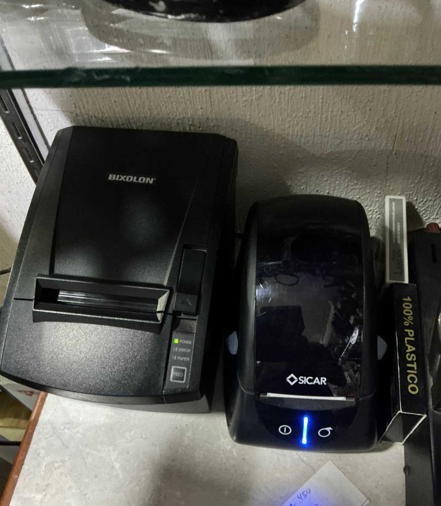

# Impresoras de la tienda

Foto del dueño, septiembre de 2026. **No se va a comprar impresora: el
sistema debe funcionar con estas dos.**

| Uso       | Equipo                     | Dónde está           |
| --------- | -------------------------- | -------------------- |
| Tickets   | **BIXOLON** térmica        | Mostrador, izquierda |
| Etiquetas | Marca **SICAR**            | Mostrador, derecha   |

La de etiquetas es la que SICAR entregó con el sistema actual. La de
tickets tiene el cortador al frente y los indicadores POWER / ERROR /
PAPER; el modelo exacto está en la etiqueta de la parte de atrás o abajo.

## Por qué esto es una buena noticia

La arquitectura ya construida coincide con este hardware. El plan original
(`PLAN_CODEX.md` §9.1) suponía comprar una impresora de red Epson o Star
que aceptara impresión por HTTP, porque **un navegador no habla ESC/POS ni
ZPL directamente** con una impresora por USB. Esa compra se cancela.

Tanto el ticket como la etiqueta se generan como HTML y se imprimen con
`window.print()`, es decir **por el controlador del sistema operativo**. Las
dos impresoras ya tienen su controlador instalado en la computadora del
mostrador, porque es con lo que opera SICAR hoy. No hace falta ePOS-Print,
ni WebPRNT, ni un puente, ni comprar nada.

- Etiquetas: `app/(workspace)/etiquetas/labels-workspace.tsx` emite
  `@page { size: anchoMM altoMM; margin: 0 }` según la plantilla guardada,
  así que se adapta a la medida real del rollo sin tocar código.
- Tickets: `components/thermal-receipt.tsx` emite
  `@page { size: 80mm auto; margin: 0 }` desde `lib/printing.ts`.
  El `auto` de la altura es lo que evita que cada ticket saque una hoja
  completa; en rollo continuo la altura la define el contenido.

## Consecuencia real: dónde corre el punto de venta

Un iPad no tiene controladores de impresora y ninguna de las dos es
AirPrint, así que Safari no les puede mandar nada. **La venta con ticket
impreso corre en la computadora del mostrador**, en su navegador.

El iPad sigue sirviendo para catálogo, inventario, conteos y consulta, que
es donde su comodidad importa. Si más adelante se quiere cobrar desde el
iPad, el camino es un puente local que consuma la tabla `print_jobs`; esa
tabla existe desde M4 justamente para no tener que rehacer el POS ese día.

Esto matiza el «touch-first para iPad» de `specs/M4_POS_Y_CAJA.md` §7: el
diseño táctil se conserva, pero el equipo que cobra e imprime es la
computadora.

## Lo que falta confirmar antes de la prueba física

1. **Modelo exacto de cada una**, de la etiqueta del equipo. Del lado
   BIXOLON define si además hay puerto de red, que abriría la opción de
   imprimir desde el iPad más adelante.
2. **Ancho del rollo de tickets:** 80 mm es lo típico en esa BIXOLON y es lo
   que el sistema asume hoy. Si resulta ser de 58 mm, se cambia una sola
   constante en `lib/printing.ts`.
3. **Medida de la etiqueta** que usan hoy, en milímetros, y si es una o dos
   por fila en el rollo.
4. **Cajón de dinero:** si está conectado al puerto de la BIXOLON, se abre
   configurando el controlador, no programando.

## La prueba física, cuando haya tiempo frente al mostrador

- [ ] Cobrar una venta de prueba e imprimir el ticket. Verificar que no
      alimente papel de más al final y que el corte caiga donde debe.
- [ ] Imprimir un ticket de regalo y confirmar que no muestra importes.
- [ ] Reimprimir un ticket ya cobrado desde la pantalla de tickets.
- [ ] Imprimir una etiqueta y **escanearla con la cámara del teléfono**.
      Es la misma prueba que cierra M2: el código generado tiene que leerse
      impreso, no sólo en pantalla.
- [ ] Escanear esa etiqueta con el lector del mostrador.
- [ ] Si el cajón está conectado, confirmar que abre al cobrar en efectivo.
